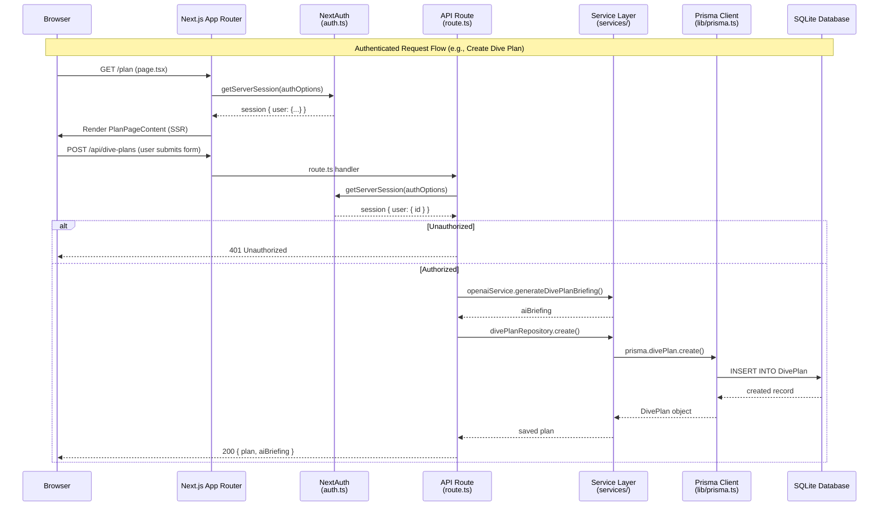
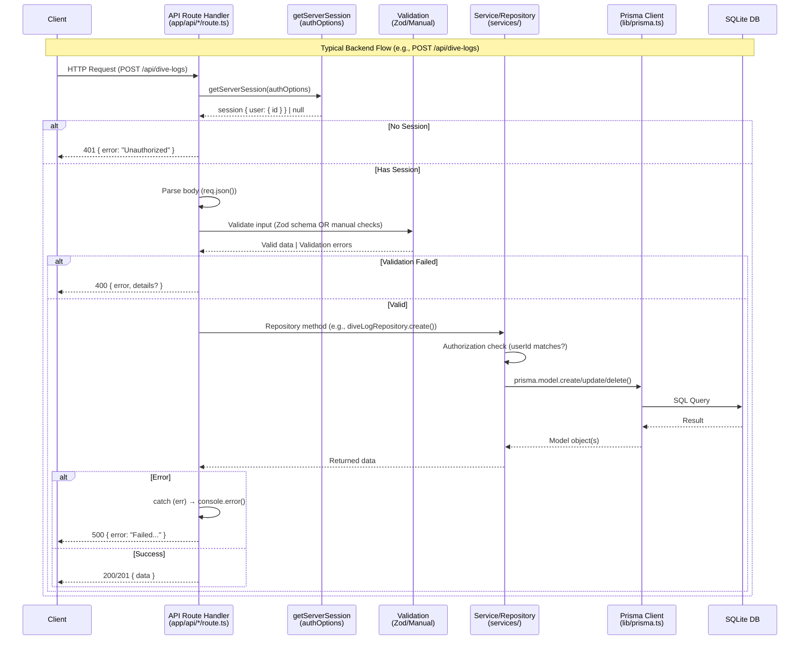

# Architecture

## High-Level Architecture

DiveIQ is a full-stack Next.js application using the App Router pattern. The architecture follows a feature-based organization with clear separation between client and server code.

## Dependency Boundaries

### Layer Hierarchy (top to bottom):

1. **Pages/Route Handlers** (`src/app/`)
   - Entry points: Server Components (`page.tsx`) and API routes (`api/*/route.ts`)
   - Depends on: Features, Services, Lib utilities

2. **Feature Modules** (`src/features/*/`)
   - Self-contained feature logic: components, hooks, types, services
   - May depend on: Shared components (`src/components/`), Lib utilities, Contexts
   - Examples: `src/features/dive-plan/`, `src/features/auth/`

3. **Shared Components** (`src/components/`)
   - Reusable UI components across features
   - May depend on: Lib utilities, Contexts, Styles

4. **Services Layer** (`src/services/`)
   - External integrations (AI, database repositories)
   - Depends on: Lib utilities (`src/lib/prisma.ts`), external APIs
   - Examples: `src/services/ai/openaiService.ts`, `src/services/database/repositories/`

5. **Lib Utilities** (`src/lib/`)
   - Pure utility functions, Prisma client
   - No dependencies on features or components
   - Examples: `src/lib/prisma.ts`, `src/lib/units.ts`, `src/lib/validation.ts`

### Boundary Rules:

- **API Routes** (`src/app/api/*/route.ts`) call Services/Repositories directly, use `getServerSession()` for auth
  - Example: `src/app/api/dive-plans/route.ts:19-101` calls `divePlanRepository` and `openaiService`
- **Page Components** (Server Components) fetch data directly via repositories, pass to feature components
  - Example: `src/app/(app)/dashboard/page.tsx:23-35` fetches via repositories, passes to `DashboardPageContent`
- **Feature Components** (Client Components) call API routes via `fetch()`
  - Example: `src/features/dive-log/hooks/useLogPageState.ts` (UNVERIFIED - check actual implementation)
- **No cross-feature dependencies**: Features should not import from other features
- **Shared code** lives in `src/components/`, `src/lib/`, `src/hooks/`, `src/contexts/`

## Request Flow Diagram

### Frontend Request Flow (Page Rendering)



### Backend API Request Flow



### Flow Details:

1. **Page Request (SSR)**:
   - Browser requests page → Next.js renders Server Component → Checks session → Renders page with data
   - Example: `src/app/(app)/dashboard/page.tsx:12-47` (server component fetches data, passes to client component)

2. **API Request (Authenticated)**:
   - Client component calls API route → API route checks `getServerSession(authOptions)` (`src/features/auth/lib/auth.ts`)
   - If authorized: Calls service layer → Service uses Prisma client (`src/lib/prisma.ts`) → Database
   - Example: `src/app/api/dive-plans/route.ts:19-101` (POST handler flow)

3. **Authentication Flow**:
   - NextAuth handles session validation via `getServerSession()` (`src/app/api/auth/[...nextauth]/route.ts`)
   - Session stored in database (Prisma adapter), validated on each request
   - Credentials: Validated against User.password (hashed) in `src/features/auth/lib/auth.ts`
   - OAuth: Redirects to provider, callback handled by NextAuth

## Application Structure

### Route Groups

Next.js route groups (`(app)`, `(auth)`, `(public)`) organize layouts without affecting URLs:

- `(app)/` - Authenticated routes with AppShell layout (`src/app/(app)/layout.tsx`)
- `(auth)/` - Authentication pages with auth-specific layout
- `(public)/` - Public routes (no auth required)

### Server vs Client Components

- **Server Components** (default): Run on server, can access database directly, no `"use client"`
  - Pages: `src/app/(app)/dashboard/page.tsx` (server component)
  - Layouts: `src/app/(app)/layout.tsx` (server component)
- **Client Components**: Marked with `"use client"`, use hooks, handle interactivity
  - Feature components: `src/features/dive-plan/components/PlanPageContent.tsx` (client component)
  - Forms: `src/features/dive-log/components/DiveLogForm.tsx` (client component)

## Directory Organization

See `docs/00_OVERVIEW.md` for detailed folder map. Key principles:

- **Feature-based**: Each feature in `src/features/{name}/` with components, hooks, types
- **Co-location**: Component styles (`.module.css`) next to components
- **Shared code**: Reusable pieces in `src/components/`, `src/lib/`, `src/hooks/`
- **API routes**: RESTful endpoints in `src/app/api/{resource}/route.ts`

## Feature-Based Architecture

Features are self-contained modules in `src/features/{feature-name}/`:

- **components/** - Feature-specific UI components
- **hooks/** - Custom React hooks for feature logic
- **types.ts** - TypeScript types for the feature
- **services/** (optional) - Feature-specific business logic (e.g., `dive-plan/services/riskCalculator.ts`)

Features should not import from other features. Shared code belongs in `src/components/`, `src/lib/`, etc.

## Data Flow Patterns

### Server-Side Data Fetching

Server Components fetch data directly via repositories:

```typescript
// src/app/(app)/dashboard/page.tsx:23-35
const [recentDives, statistics, recentPlans] = await Promise.all([
  diveLogRepository.findMany({ ... }),
  diveLogRepository.getStatistics(userId),
  divePlanRepository.findMany({ ... }),
]);
```

### Client-Side Data Fetching

Client Components call API routes via `fetch()`:

- Forms submit to API routes (e.g., `POST /api/dive-logs`)
- Hooks manage API state (e.g., `useLogPageState`, `usePlanPageState`)

## API Route Structure

API routes in `src/app/api/{resource}/route.ts` export HTTP method handlers:

- `GET` - Read operations
- `POST` - Create operations (or RPC-style actions with body.action)
- `PUT` - Update operations
- `PATCH` - Partial updates
- `DELETE` - Delete operations

All routes check authentication via `getServerSession(authOptions)` (`src/features/auth/lib/auth.ts`).

Example: `src/app/api/dive-plans/route.ts` exports GET, POST, PUT, DELETE handlers.

## State Management Approach

- **Server State**: Fetched in Server Components, passed as props
- **Client State**: React hooks (`useState`, `useReducer`) in Client Components
- **Global State**: React Context (`src/contexts/UnitSystemContext.tsx` for unit preferences)
- **Form State**: Controlled inputs with React state
- **API State**: Custom hooks manage loading/error states (e.g., `useLogPageState`, `usePlanPageState`)

No external state management library (Redux, Zustand, etc.) - uses React built-ins.

## Styling Architecture

- **CSS Modules**: Component-scoped styles (`.module.css` files)
- **Design System**: Design tokens in `src/styles/design-system/`
  - `tokens.css` - Design tokens (colors, spacing, etc.)
  - `typography.css` - Typography system
  - `utilities.css` - Utility classes
- **Shared Component Styles**: `src/styles/components/` (Button, Card, Form, etc.)
- **Co-location**: Component styles live next to components (`ComponentName.module.css`)
- **Tailwind CSS**: Available but primarily using CSS Modules (UNVERIFIED - check actual usage)

---

Last verified against commit:
