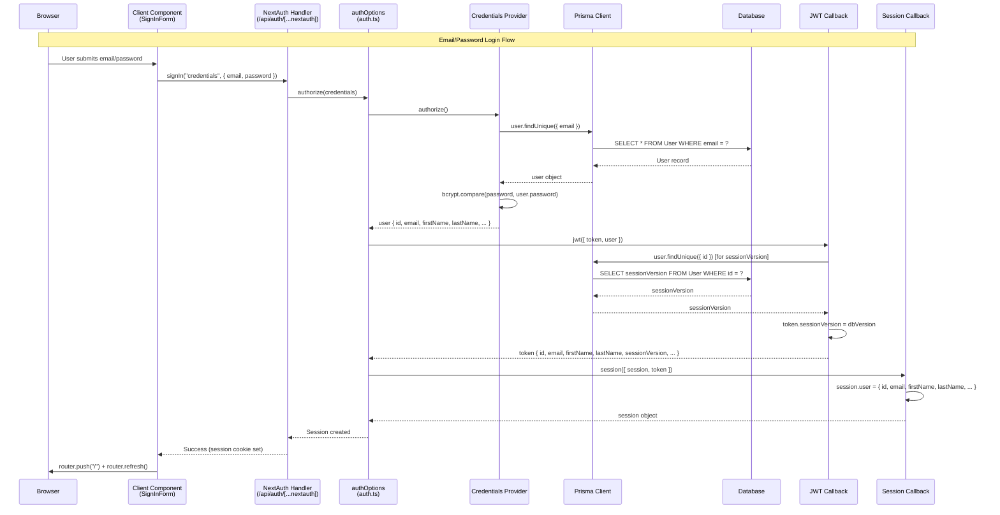
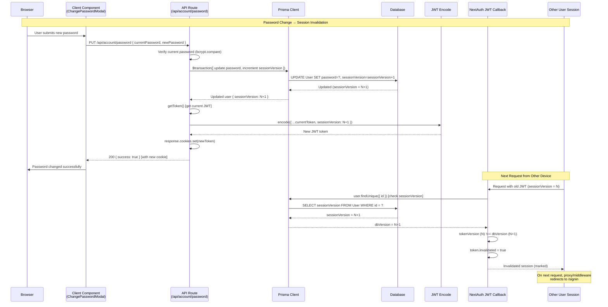

# Authentication

## NextAuth Configuration

### Configuration Location

**Primary configuration**: `src/features/auth/lib/auth.ts:79-538`

Exported as `authOptions` and used by NextAuth handler:

```typescript
// src/app/api/auth/[...nextauth]/route.ts:1-6
import NextAuth from "next-auth";
import { authOptions } from "@/features/auth/lib/auth";

const handler = NextAuth(authOptions);
export { handler as GET, handler as POST };
```

### Providers

Two authentication providers configured:

1. **Credentials Provider** (`src/features/auth/lib/auth.ts:82-121`)
   - Name: `"credentials"`
   - Email/password authentication
   - Authorize function: Validates email/password against database, returns user object with `id`, `email`, `firstName`, `lastName`, `image`, `avatarUrl`
   - Password verification: Uses `bcrypt.compare()` (`src/features/auth/lib/auth.ts:103-106`)

2. **Google OAuth Provider** (`src/features/auth/lib/auth.ts:122-125`)
   - Client ID: `process.env.GOOGLE_CLIENT_ID`
   - Client Secret: `process.env.GOOGLE_CLIENT_SECRET`
   - Uses NextAuth Google provider

### Session Strategy

**JWT-based sessions** (`src/features/auth/lib/auth.ts:127-129`):

```typescript
session: {
  strategy: "jwt",
}
```

Uses Prisma adapter for OAuth account linking (`src/features/auth/lib/auth.ts:80`):

```typescript
adapter: PrismaAdapter(prisma),
```

### Custom Pages

Custom NextAuth pages configured (`src/features/auth/lib/auth.ts:130-134`):

- `signIn: "/signin"`
- `signOut: "/"`
- `error: "/signin"` (with error query param)

## JWT Callback Behavior

**JWT callback location**: `src/features/auth/lib/auth.ts:345-492`

### Token Fields Set

**On sign-in** (`src/features/auth/lib/auth.ts:347-396`):

- `token.id` - Always set from `user.id` (line 349)
- `token.email` - Set from `user.email` (line 350)
- `token.firstName` - Set from user object or fetched from DB (line 354, 372)
- `token.lastName` - Set from user object or fetched from DB (line 355, 373)
- `token.avatarUrl` - Set from user object or fetched from DB (line 356-359, 374)
- `token.sessionVersion` - Fetched from database (line 368-379, 387-395)

**On every callback** (`src/features/auth/lib/auth.ts:399-432`):

- Session version validation: Fetches current `sessionVersion` from database (line 403-406)
- Compares token version vs database version (line 414-418)
- Sets `token.invalidated = true` if versions don't match (line 418-427)
- Updates `token.sessionVersion` to current DB value (line 430)
- Sets `token.invalidated = false` if valid (line 431)

**On session update trigger** (`src/features/auth/lib/auth.ts:440-489`):

- Handles `trigger === "update"` (e.g., after avatar upload)
- Updates `token.avatarUrl` from update() call or re-fetches from DB (line 442-488)

### SessionVersion Validation Strategy

**Session invalidation via `sessionVersion`**:

1. **Database field**: User model has `sessionVersion` integer field (default: 0)
2. **JWT callback check**: On every JWT callback, compares token's `sessionVersion` with database value (`src/features/auth/lib/auth.ts:399-432`)
3. **Mismatch handling**: If versions don't match, sets `token.invalidated = true`
4. **Version increment**: Password changes increment `sessionVersion` (`src/app/api/account/password/route.ts:111-113`)

This invalidates all existing sessions when password changes, except the current session (which gets a new JWT with updated `sessionVersion`).

## Session Callback Behavior

**Session callback location**: `src/features/auth/lib/auth.ts:493-535`

### Session Fields Set

**Session user object** populated from token (`src/features/auth/lib/auth.ts:516-523`):

- `session.user.id` - From `token.id` or `token.sub` (line 517)
- `session.user.email` - From `token.email` (line 518)
- `session.user.firstName` - From `token.firstName` (line 519)
- `session.user.lastName` - From `token.lastName` (line 520)
- `session.user.avatarUrl` - From `token.avatarUrl` (line 521-522)
- `session.user.sessionVersion` - From `token.sessionVersion` (line 523)

**Type definitions**: Extended in `src/types/next-auth.d.ts:5-13`

### Invalidated Token Handling

If token is invalidated or missing, session callback returns unchanged session (`src/features/auth/lib/auth.ts:502-504`):

- Proxy/middleware handles redirects (line 501)
- Session object itself is not nullified

## Protected Routes Enforcement

### App Router Protection Patterns

**1. Server Component Pages** (per-route checks):

Protected pages use `getServerSession()` and redirect if not authenticated:

```typescript
// src/app/(app)/dashboard/page.tsx:12-20
export default async function DashboardPage() {
  const session = await getServerSession(authOptions);
  const userId = session?.user?.id;

  if (!userId) {
    redirect("/");
  }
  // ... render authenticated content
}
```

**2. API Routes** (per-handler checks):

All protected API routes check session at start:

```typescript
// src/app/api/dive-logs/route.ts:14-19
export async function GET(req: NextRequest) {
  const session = await getServerSession(authOptions);
  if (!session?.user) {
    return NextResponse.json({ error: "Unauthorized" }, { status: 401 });
  }
  // ... handle request
}
```

**3. Proxy/Middleware** (UNVERIFIED - see note below):

File exists: `src/proxy.ts` with middleware-like code, but:

- No `middleware.ts` file found (Next.js requires `middleware.ts` at root)
- `proxy.ts` not imported anywhere
- Has `export const config` with matcher pattern (line 104-116)
- **Status**: Appears to be unimplemented/unused

**Note**: The `proxy.ts` file contains code that looks like Next.js middleware (checks JWT token, redirects to signin), but it's not being used. Protected routes currently rely on per-route checks in Server Components and API handlers.

### Public Routes

**Public pages** (no auth required):

- `/` (homepage - shows public home or redirects if authenticated)
- `/signin`, `/signup` (auth pages)
- `/(public)/dive-plans` (public dive plan viewer)

**Public API endpoints**:

- `/api/auth/*` (NextAuth endpoints)
- `/api/dive-plans/preview` (guest plan preview)
- `/api/auth/signup` (public signup)

### Protected Route List

Based on `proxy.ts` (if it were implemented, line 15-27):

- `/dashboard`
- `/settings`
- `/profile`
- `/dive-logs`
- `/plan`
- `/gear`
- `/certifications`
- `/community`
- `/insights`
- `/sites`
- `/trips`
- `/logbook`

## Edge Runtime Constraints

### Runtime Configuration

**Some API routes explicitly set Node.js runtime**:

```typescript
// src/app/api/certifications/route.ts:1
export const runtime = "nodejs";
```

Routes that need Node.js runtime (Prisma, bcrypt, etc.):

- `/api/certifications/route.ts`
- `/api/certifications/definitions/route.ts`
- `/api/certifications/[id]/route.ts`

**Other routes** (default to Node.js):

- Most routes use `getServerSession()` which requires Node.js runtime
- Prisma client requires Node.js runtime

### Proxy/Middleware Approach

**Current status**: `src/proxy.ts` exists but appears **unused/unimplemented**.

**Proxy code** (`src/proxy.ts:10-101`):

- Uses `getToken()` from `next-auth/jwt` (edge-safe, line 41-44)
- Checks JWT token presence and validity
- Validates `sessionVersion` on token
- Redirects to `/signin` if invalid/missing
- Has config matcher for route matching (line 104-116)

**Why it's not working**:

- Next.js middleware must be in file named `middleware.ts` at root of `src/` or project root
- `proxy.ts` is not named correctly and not imported/exported as middleware

**Recommendation**: Either implement proper `middleware.ts` using the proxy code, or remove `proxy.ts` if not needed.

## Google OAuth vs Email/Password Users

### Profile Data Storage Differences

**1. Password Field**:

- **Email/Password users**: `User.password` is set (hashed with bcrypt, `src/app/api/auth/signup/route.ts:51`)
- **Google OAuth users**: `User.password` is `null` (`src/features/auth/lib/auth.ts:99` - credentials check)

**2. Account Linking**:

- **Email/Password users**: No `Account` record (credentials provider doesn't use OAuth accounts)
- **Google OAuth users**: `Account` record exists with `provider: "google"` (`src/features/auth/lib/auth.ts:264-279, 312-324`)

**3. Name Fields**:

- **Email/Password users**: `firstName` and `lastName` provided during signup (`src/app/api/auth/signup/route.ts:54-59`)
- **Google OAuth users**: Names extracted from Google profile (`src/features/auth/lib/auth.ts:35-77`)
  - Prefers `given_name` and `family_name` from profile
  - Falls back to splitting `name` field
  - Can be `null` if Google doesn't provide name

**4. Avatar/Image**:

- **Email/Password users**: `avatarUrl` starts as `null`, user can upload via `/api/me/avatar`
- **Google OAuth users**: `avatarUrl` set from Google profile image on first sign-in (`src/features/auth/lib/auth.ts:196-197, 254-255, 309`)
  - Also sets legacy `image` field
  - `avatarUrl` is preferred over `image` field

**5. Email Verification**:

- **Email/Password users**: `emailVerified` is `null` (not verified)
- **Google OAuth users**: `emailVerified` set to current date on account creation (`src/features/auth/lib/auth.ts:310`)

### Sign-In Flow Differences

**Email/Password** (`src/features/auth/lib/auth.ts:88-120`):

1. User provides email/password
2. Lookup user by email
3. Verify password with `bcrypt.compare()`
4. Return user object with fields from database

**Google OAuth** (`src/features/auth/lib/auth.ts:136-340`):

1. User clicks Google sign-in button
2. Redirected to Google OAuth
3. Callback received by `signIn` callback
4. Check if Account exists with Google ID (line 153-170)
5. If account exists: Update names/avatar if missing, link to existing user (line 172-221)
6. If user exists by email but no Account: Create Account record, link accounts (line 224-298)
7. If new user: Create User + Account records (line 301-335)
8. Extract names from Google profile (line 143-146)

### Account Linking Behavior

**Email linking**: If user signs in with Google but email already exists in database (from credentials signup):

- Google Account is linked to existing User record
- User can then sign in with either method
- Names/avatar backfilled if missing (`src/features/auth/lib/auth.ts:237-298`)

## Login Flow Sequence Diagram



## Session Invalidation / Password Change Flow



### Session Invalidation Details

**Password change process** (`src/app/api/account/password/route.ts:104-151`):

1. **Update password and sessionVersion atomically** (transaction, line 105-119):
   - Update `User.password` (hashed)
   - Increment `User.sessionVersion` (N → N+1)

2. **Preserve current session** (line 121-132):
   - Get current JWT token
   - Create new JWT with updated `sessionVersion`
   - Set new cookie on response

3. **Invalidate other sessions**:
   - Other devices have JWT with `sessionVersion = N`
   - On next request, JWT callback compares token version (N) vs DB version (N+1)
   - Sets `token.invalidated = true` (`src/features/auth/lib/auth.ts:418-427`)
   - Proxy/middleware (if implemented) would redirect to `/signin`

**Note**: Current session stays valid because it receives a new JWT cookie with updated `sessionVersion`.

---

Last verified against commit:
