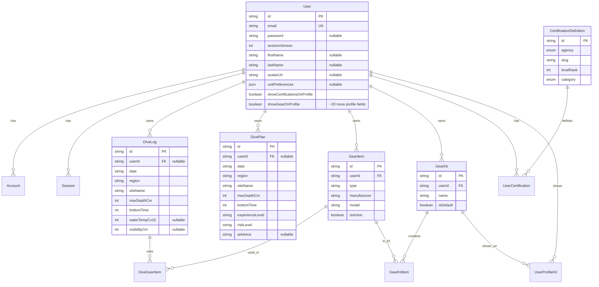

# Database

## Prisma Schema Overview

**Schema location**: `prisma/schema.prisma`

**Database**: SQLite (development) - configured in `prisma/schema.prisma:5-8`

**Prisma Client**: Generated singleton in `src/lib/prisma.ts` with global instance pattern for development hot-reload.

### Key Models and Relationships

**Authentication Models** (NextAuth.js):

- **User** (`prisma/schema.prisma:23-66`) - Central user model with authentication and profile fields
- **Account** (`prisma/schema.prisma:68-85`) - OAuth account linking (Google, etc.)
- **Session** (`prisma/schema.prisma:87-93`) - NextAuth session storage (JWT strategy used, but table exists)
- **VerificationToken** (`prisma/schema.prisma:95-101`) - Email verification tokens

**Core Application Models**:

- **DiveLog** (`prisma/schema.prisma:104-122`) - Individual dive log entries
- **DivePlan** (`prisma/schema.prisma:124-140`) - Saved dive plans with AI briefings
- **GearItem** (`prisma/schema.prisma:143-164`) - User's dive gear inventory
- **GearKit** (`prisma/schema.prisma:166-180`) - Collections of gear items
- **GearKitItem** (`prisma/schema.prisma:196-207`) - Join table: GearKit ↔ GearItem
- **DiveGearItem** (`prisma/schema.prisma:209-220`) - Join table: DiveLog ↔ GearItem (gear used on specific dive)
- **UserProfileKit** (`prisma/schema.prisma:182-194`) - Join table: User ↔ GearKit (kits shown on profile)
- **CertificationDefinition** (`prisma/schema.prisma:223-237`) - Catalog of available certifications (PADI, SSI)
- **UserCertification** (`prisma/schema.prisma:239-260`) - User's earned certifications

**Enums**:

- `CertificationAgency` (`prisma/schema.prisma:11-14`) - PADI, SSI
- `CertificationCategory` (`prisma/schema.prisma:16-20`) - core, specialty, professional

### Entity Relationship Diagram



### Relationships Summary

**User relationships**:

- One-to-many: `User → Account`, `User → Session`, `User → DiveLog`, `User → DivePlan`, `User → GearItem`, `User → GearKit`, `User → UserCertification`
- Many-to-many (via join): `User ↔ GearKit` (via `UserProfileKit`)

**Gear relationships**:

- Many-to-many: `GearKit ↔ GearItem` (via `GearKitItem`)
- Many-to-many: `DiveLog ↔ GearItem` (via `DiveGearItem`)
- Many-to-many: `User ↔ GearKit` for profile display (via `UserProfileKit`)

**Certification relationships**:

- One-to-many: `CertificationDefinition → UserCertification`
- Many-to-one: `UserCertification → User`

**Cascade deletes**: All relations use `onDelete: Cascade` - deleting a User deletes all related records.

## Core Models for Product Functionality

**Essential models** (product wouldn't function without):

1. **User** - Authentication and user identity
2. **DiveLog** - Core feature: dive logging
3. **DivePlan** - Core feature: dive planning with AI
4. **GearItem** - Core feature: gear tracking
5. **GearKit** - Core feature: gear kit management

**Supporting models**:

- **GearKitItem**, **DiveGearItem**, **UserProfileKit** - Join tables for many-to-many relationships
- **CertificationDefinition**, **UserCertification** - Feature: certification tracking
- **Account**, **Session**, **VerificationToken** - Authentication infrastructure (NextAuth)

**Business logic dependencies**:

- Dive planning requires: `DivePlan` model
- Dive logging requires: `DiveLog` model, optionally `GearItem` (via `DiveGearItem`)
- Gear management requires: `GearItem`, `GearKit`, `GearKitItem`
- Profile display requires: `User`, `UserProfileKit`, `GearKit`, `UserCertification`

## Migration Strategy

### Migration Location

**Migrations directory**: `prisma/migrations/`

**Migration files**: Each migration is a timestamped directory containing `migration.sql`:

- Format: `YYYYMMDDHHMMSS_migration_name/`
- Example: `20251203180033_init_dive_log/migration.sql`

### Migration Commands

**Standard Prisma CLI commands** (not in package.json scripts):

- Create migration: `npx prisma migrate dev --name migration_name`
- Apply migrations: `npx prisma migrate deploy` (production)
- Reset database: `npm run db:reset` (`package.json:21`) - runs `prisma migrate reset --force --skip-seed`

**No migration script in package.json** - migrations run via Prisma CLI directly.

### Migration History

**Migration timeline** (from `prisma/migrations/` directory):

1. `20251203180033_init_dive_log` - Initial dive log model
2. `20251203181912_add_dive_plan` - Added dive plans
3. `20251204061918_add_authentication` - Added NextAuth models (User, Account, Session, VerificationToken)
4. `20251228023805_add_firstname_lastname` - Added firstName/lastName fields
5. `20251228024041_add_gear_tracking` - Added gear models
6. `20251228024358_add_profile_fields` - Added profile fields to User
7. `20251228215242_add_profile_fields` - Additional profile fields
8. `20251229054639_add_avatar_url` - Added avatarUrl field
9. `20251229134504_add_session_version` - Added sessionVersion for session invalidation
10. `20251229202212_add_unit_preferences_and_fixed_point` - Added unitPreferences, changed depth/temp to fixed-point (cm, C×10)
11. `20251230185537_add_certifications` - Added certification models
12. `20251230194926_add_show_certifications_on_profile` - Added showCertificationsOnProfile flag
13. `20251230200504_add_show_gear_on_profile` - Added showGearOnProfile flag
14. `20251230201759_add_user_profile_kit` - Added UserProfileKit join table

### Migration Lock

**Migration lock file**: `prisma/migrations/migration_lock.toml` - Ensures migrations run with compatible Prisma version.

## Seed Scripts

### Seed Script

**Location**: `prisma/seed.ts`

**Purpose**: Seeds `CertificationDefinition` catalog with PADI and SSI certifications.

**How it works**:

1. Reads JSON file: `prisma/seed-data/certifications.json`
2. Upserts each certification definition (creates if new, updates if exists)
3. Uses `agency_slug` unique constraint to identify existing records

**Run manually**: `npx prisma db seed` (uses `package.json:55-57` config: `tsx prisma/seed.ts`)

**Run on reset**: `npx prisma migrate reset` (runs seed automatically, but `db:reset` script skips it with `--skip-seed`)

### When to Run Seed

- After database reset (if not using `--skip-seed`)
- After adding new certification definitions to JSON file
- After fresh database setup

## Backfill Scripts

### Backfill Scripts Location

**Directory**: `scripts/`

**Scripts**:

- `backfill-user-first-last.ts` - Migrates `User.name` → `firstName`/`lastName`
- `backfill-user-names.ts` - (UNVERIFIED - check if different purpose)

### Backfill Script: User Names

**File**: `scripts/backfill-user-first-last.ts`

**Purpose**: One-time migration script to split existing `User.name` field into `firstName` and `lastName`.

**When to run**: After migration `20251228023805_add_firstname_lastname` was applied to existing database.

**How it works**:

1. Finds users where `firstName` OR `lastName` is null AND `name` field exists and is not empty
2. Uses `splitFullName()` helper from `src/features/auth/lib/name.ts` to split name
3. Updates only null fields (doesn't overwrite existing data)

**Run manually**: `npx tsx scripts/backfill-user-first-last.ts`

**Status**: One-time migration script - likely no longer needed for fresh databases.

## Common Query Patterns

### Repository Pattern

**Data access layer**: `src/services/database/repositories/`

All database queries go through repository modules:

- `diveLogRepository.ts` - Dive log operations
- `divePlanRepository.ts` - Dive plan operations
- `gearRepository.ts` - Gear operations (items, kits, associations)

**Direct Prisma usage**: Some routes bypass repositories and use Prisma directly (see `docs/03_BACKEND.md` for details).

### Common Patterns

**1. User-scoped queries** (all repositories):

```typescript
// Pattern: Filter by userId, check ownership on update/delete
const where: Prisma.ModelWhereInput = { userId };
// or
const existing = await prisma.model.findFirst({ where: { id, userId } });
if (!existing) throw new Error("Not found or unauthorized");
```

**Location**: All repository methods check `userId` for authorization.

**2. FindMany with options**:

```typescript
// Pattern: Optional filtering, ordering, pagination
async findMany(options?: {
  orderBy?: "date" | "createdAt";
  take?: number;
  userId?: string;
}): Promise<Model[]>
```

**Location**: `src/services/database/repositories/diveLogRepository.ts:46-60`, `divePlanRepository.ts:57-75`

**3. Aggregations**:

```typescript
// Pattern: Count + aggregate in parallel
const [count, aggregates] = await Promise.all([
  prisma.model.count({ where }),
  prisma.model.aggregate({
    where,
    _sum: { field: true },
    _max: { field: true },
  }),
]);
```

**Location**: `src/services/database/repositories/diveLogRepository.ts:130-137` (getStatistics)

**4. Many-to-many associations**:

```typescript
// Pattern: Load relations via join tables
const gearItems = await prisma.diveGearItem.findMany({
  where: { diveId },
  include: { gearItem: true },
});
```

**Location**: `src/services/database/repositories/gearRepository.ts` (getGearForDive, setGearForDive)

**5. Transactions**:

```typescript
// Pattern: Atomic operations
await prisma.$transaction(async (tx) => {
  await tx.model1.update({ ... });
  await tx.model2.create({ ... });
});
```

**Location**: `src/app/api/account/password/route.ts:105-119` (password update + sessionVersion increment)

### Query Locations

**Repository queries** (recommended pattern):

- `src/services/database/repositories/diveLogRepository.ts`
- `src/services/database/repositories/divePlanRepository.ts`
- `src/services/database/repositories/gearRepository.ts`

**Direct Prisma queries** (bypass repositories):

- `src/app/api/profile/route.ts` - Complex profile queries with nested relations
- `src/app/api/certifications/route.ts` - Certification queries
- `src/app/api/auth/signup/route.ts` - User creation
- `src/features/auth/lib/auth.ts` - NextAuth callbacks (OAuth, JWT)

**Note**: See `docs/03_BACKEND.md` for discussion of direct Prisma usage vs repository pattern.

## Schema Smells and Issues

### 1. Overloaded User Model

**Issue**: `User` model contains 30+ fields mixing concerns (`prisma/schema.prisma:23-66`):

- **Authentication fields**: `email`, `password`, `sessionVersion`, `emailVerified` (lines 25-28)
- **Basic profile**: `firstName`, `lastName`, `image`, `avatarUrl`, `birthday`, `location`, `bio`, `pronouns`, `website` (lines 29-37)
- **DiveIQ-specific profile**: `homeDiveRegion`, `languages`, `primaryDiveTypes`, `experienceLevel`, `yearsDiving`, etc. (lines 40-52)
- **Preferences**: `unitPreferences`, `showCertificationsOnProfile`, `showGearOnProfile` (lines 50-52)

**Impact**: Model is large, harder to maintain, mixes authentication and domain concerns.

**Recommendation**: Consider splitting into `User` (auth) + `UserProfile` (domain) with one-to-one relationship.

### 2. Excessive Optional Fields

**Issue**: Most profile fields are nullable (`String?`, `Int?`, `Json?`) - 20+ optional fields (`prisma/schema.prisma:29-52`).

**Examples**:

- `firstName`, `lastName` (line 29-30) - Nullable for Google OAuth users
- All dive-specific profile fields nullable (lines 40-49)
- `unitPreferences` (line 50) - JSON field, nullable

**Impact**:

- Hard to know which fields are actually required vs optional
- Many null checks in application code
- Unclear data invariants

**Recommendation**: Use default values where appropriate, or clearly document required vs optional fields per user type (OAuth vs credentials).

### 3. JSON Fields for Structured Data

**Issue**: Arrays stored as JSON strings instead of normalized tables (`prisma/schema.prisma:42, 46, 47, 50`):

- `primaryDiveTypes` - JSON array (line 42)
- `typicalDivingEnvironment` - JSON array (line 46)
- `lookingFor` - JSON array (line 47)
- `unitPreferences` - JSON object (line 50)

**Impact**:

- Can't query/filter efficiently on JSON fields
- No referential integrity
- Type safety issues (JSON parsed at runtime)

**Recommendation**: For `unitPreferences`, consider separate columns or enum. For arrays, consider join tables if querying is needed.

### 4. String Dates

**Issue**: `DiveLog.date` and `DivePlan.date` stored as `String` instead of `DateTime` (`prisma/schema.prisma:107, 127`).

**Impact**:

- No date validation at database level
- Date parsing/formatting in application code
- Can't use SQL date functions

**Recommendation**: Use `DateTime` type if timezone handling isn't needed, or document why strings are used (e.g., date-only without time).

### 5. Fixed-Point Integer Storage

**Issue**: Depth/temperature stored as integers (centimeters, tenths of Celsius) instead of decimals (`prisma/schema.prisma:110-113, 130`):

- `maxDepthCm` - Integer (centimeters) (line 110, 130)
- `waterTempCx10` - Integer (tenths of Celsius) (line 112)

**Impact**:

- Requires conversion functions in application code
- Less readable in database
- Precision limited to fixed increments

**Note**: This is intentional (documented in comments as "fixed-point canonical") - likely for precision and consistency. Not necessarily a smell, but worth documenting the pattern.

### 6. Optional userId for Future Guest Support

**Issue**: `DiveLog.userId` and `DivePlan.userId` are nullable (`String?`) with comment "Optional to allow future guest data migration" (`prisma/schema.prisma:106, 126`).

**Impact**:

- Queries must handle null userId
- Authorization logic must account for null
- Unclear if guest feature is actually planned

**Recommendation**: Remove if guest feature isn't planned, or implement guest feature to justify nullable field.

### 7. Missing Indexes on Common Queries

**Issue**: Some query patterns may benefit from additional indexes:

- `DiveLog` has index on `userId` (line 121) - good
- `DivePlan` has index on `userId` (line 139) - good
- `GearItem` has composite index `[userId, isActive]` (line 163) - good
- No index on `DiveLog.date` for date-range queries
- No index on `DivePlan.date` for date queries

**Impact**: Date-range queries may be slower as data grows.

**Recommendation**: Add indexes if date-range queries are common.

### 8. Session Table Unused

**Issue**: `Session` model exists (`prisma/schema.prisma:87-93`) but NextAuth uses JWT strategy (`src/features/auth/lib/auth.ts:127-129`).

**Impact**: Table exists but is unused (NextAuth adapter creates it, but JWT strategy doesn't use it).

**Recommendation**: Acceptable - NextAuth adapter creates it regardless. Can ignore or document that it's unused with JWT strategy.

---

Last verified against commit:
