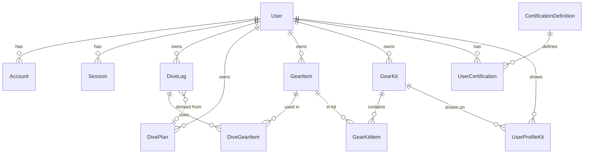

# Database

## Engine & Connection

- **Database engine:** SQLite
- **Provider:** `sqlite` (configured in `prisma/schema.prisma` line 7)
- **Connection:** `DATABASE_URL` environment variable, pointing to a local file (e.g. `file:/path/to/prisma/dev.db`)
- **ORM:** Prisma with `prisma-client-js` generator
- **Prisma singleton:** `src/lib/prisma.ts` — global instance pattern for dev hot-reload. Never instantiate `new PrismaClient()` directly.

## Schema Location

`prisma/schema.prisma`

## Enums

### CertificationAgency

```
PADI | SSI | NAUI | SDI_TDI | BSAC | CMAS | GUE | RAID
```

Note: NAUI through RAID were added in DIV-42. Prior to that, only PADI and SSI were supported.

### CertificationCategory

```
core | specialty | professional
```

## Models

### Authentication Models (NextAuth.js)

#### User

Central user model combining authentication and profile fields.

| Field | Type | Modifiers | Notes |
|-------|------|-----------|-------|
| id | String | @id @default(cuid()) | |
| email | String | @unique | |
| emailVerified | DateTime? | | |
| password | String? | | Hashed (bcrypt) for credentials provider; null for OAuth-only users |
| sessionVersion | Int | @default(0) | Incremented on password change to invalidate other JWT sessions |
| firstName | String? | | |
| lastName | String? | | Nullable for Google OAuth users who only have a display name |
| image | String? | | NextAuth default avatar field |
| avatarUrl | String? | | App-preferred avatar URL (takes precedence over `image`) |
| birthday | DateTime? | | Private, not displayed publicly |
| location | String? | | City, country |
| bio | String? | | |
| pronouns | String? | | |
| website | String? | | |
| homeDiveRegion | String? | | |
| languages | String? | | Comma-separated |
| primaryDiveTypes | String? | | JSON array stored as string |
| experienceLevel | String? | | "Beginner" \| "Intermediate" \| "Advanced" |
| yearsDiving | Int? | | |
| certifyingAgency | String? | | Free-text (e.g. "PADI", "NAUI") |
| typicalDivingEnvironment | String? | | JSON array stored as string |
| lookingFor | String? | | JSON array stored as string |
| favoriteDiveType | String? | | |
| favoriteDiveLocation | String? | | |
| unitPreferences | Json? | | `{ depth: "ft"\|"m", temperature: "f"\|"c", pressure: "psi"\|"bar", weight: "lb"\|"kg" }` |
| showCertificationsOnProfile | Boolean | @default(true) | |
| showGearOnProfile | Boolean | @default(true) | |
| hasCompletedOnboarding | Boolean | @default(false) | Gates onboarding flow |
| createdAt | DateTime | @default(now()) | |
| updatedAt | DateTime | @updatedAt | |

**Relations:** diveLogs, divePlans, gearItems, gearKits, profileKits, accounts, sessions, certifications

#### Account

OAuth account linking (NextAuth adapter model).

| Field | Type | Modifiers | Notes |
|-------|------|-----------|-------|
| id | String | @id @default(cuid()) | |
| userId | String | | FK to User |
| type | String | | |
| provider | String | | |
| providerAccountId | String | | |
| refresh_token | String? | | snake_case required by NextAuth |
| access_token | String? | | |
| expires_at | Int? | | |
| token_type | String? | | |
| scope | String? | | |
| id_token | String? | | |
| session_state | String? | | |

**Relation:** `user User @relation(..., onDelete: Cascade)`
**Indexes:** `@@unique([provider, providerAccountId])`, `@@index([userId])`

#### Session

NextAuth session storage. The app uses JWT strategy, so this table exists but is largely unused.

| Field | Type | Modifiers |
|-------|------|-----------|
| id | String | @id @default(cuid()) |
| sessionToken | String | @unique |
| userId | String | FK to User |
| expires | DateTime | |

**Relation:** `user User @relation(..., onDelete: Cascade)`
**Indexes:** `@@index([userId])`

#### VerificationToken

Email verification tokens (NextAuth adapter model).

| Field | Type | Modifiers |
|-------|------|-----------|
| identifier | String | |
| token | String | @unique |
| expires | DateTime | |

**Indexes:** `@@unique([identifier, token])`

---

### Core Application Models

#### DiveLog

Individual dive log entries. Stores all measurements in canonical fixed-point units.

| Field | Type | Modifiers | Notes |
|-------|------|-----------|-------|
| id | String | @id @default(cuid()) | |
| userId | String | | FK to User (non-nullable) |
| date | String | | YYYY-MM-DD format (see Known Tech Debt) |
| startTime | String? | | e.g. "09:30" |
| endTime | String? | | e.g. "10:15" |
| diveNumber | Int? | | Effective display number (auto or override) |
| diveNumberAuto | Int? | | Auto-computed chronological number |
| diveNumberOverride | Int? | | User override, if set |
| region | String? | | Location/region |
| siteName | String | | Required |
| buddyName | String? | | |
| diveTypeTags | String? | | JSON array: `["Shore","Boat","Night",...]` |
| maxDepthCm | Int? | | Depth in centimeters (fixed-point) |
| bottomTime | Int? | | Minutes |
| safetyStopDepthCm | Int? | | e.g. 457 = 15ft / 4.57m |
| safetyStopDurationMin | Int? | | |
| surfaceIntervalMin | Int? | | |
| waterTempCx10 | Int? | | Surface temp in tenths of Celsius (e.g. 235 = 23.5°C) |
| waterTempBottomCx10 | Int? | | Bottom temp in tenths of Celsius |
| visibilityCm | Int? | | Visibility distance in centimeters |
| current | String? | | None\|Light\|Moderate\|Strong |
| gasType | String? | | Air\|Nitrox\|Other |
| fO2 | Int? | | Nitrox O2 % (e.g. 32) |
| tankCylinder | String? | | "AL80", "HP100", etc. |
| startPressureBar | Float? | | Start pressure in bar |
| endPressureBar | Float? | | End pressure in bar |
| exposureProtection | String? | | Rashguard\|3mm\|5mm\|7mm\|Drysuit\|Other |
| weightUsedKg | Float? | | Weight in kg |
| gearKitId | String? | | Optional FK to GearKit (informational, no relation enforced) |
| gearNotes | String? | | Exceptions/notes about gear |
| isTrainingDive | Boolean | @default(false) | |
| trainingCourse | String? | | |
| trainingInstructor | String? | | |
| trainingSkills | String? | | JSON array or comma-separated |
| notes | String? | | |
| rating | Int? | | 1-5 star rating |
| placeId | String? | | Google Places ID |
| latitude | Float? | | Geo coordinate |
| longitude | Float? | | Geo coordinate |
| country | String? | | Country name |
| isPublic | Boolean | @default(false) | Share/export visibility |
| divePlanId | String? | | FK to originating DivePlan |
| source | String? | | "manual"\|"garmin"\|"shearwater"\|"subsurface" |
| createdAt | DateTime | @default(now()) | |
| updatedAt | DateTime | @updatedAt | |

**Relations:**
- `user User @relation(fields: [userId], references: [id], onDelete: Cascade)`
- `divePlan DivePlan? @relation(fields: [divePlanId], references: [id], onDelete: SetNull)`
- `gearItems DiveGearItem[]`

**Indexes:** `@@index([userId])`, `@@index([userId, createdAt])`, `@@index([userId, date])`

#### DivePlan

AI-generated dive plans with structured briefings.

| Field | Type | Modifiers | Notes |
|-------|------|-----------|-------|
| id | String | @id @default(cuid()) | |
| userId | String | | FK to User (non-nullable) |
| date | String | | String date from plan creation context |
| region | String | | Required |
| siteName | String | | Required |
| maxDepthCm | Int | | Depth in centimeters (fixed-point) |
| bottomTime | Int | | Minutes |
| experienceLevel | String | | "Beginner"\|"Intermediate"\|"Advanced" |
| riskLevel | String | | "Low"\|"Moderate"\|"High"\|"Extreme" |
| aiAdvice | String? | | Legacy plain-text summary (first key consideration) |
| aiBriefing | Json? | | Structured JSON briefing object |
| placeId | String? | | Google Places ID |
| latitude | Float? | | Geo coordinate |
| longitude | Float? | | Geo coordinate |
| country | String? | | Country name |
| isPublic | Boolean | @default(false) | Share/export visibility |
| plannedDate | DateTime? | | When the dive is planned to occur (for dashboard widgets) |
| shareToken | String? | @unique | Unique token for shareable URLs |
| createdAt | DateTime | @default(now()) | |
| updatedAt | DateTime | @updatedAt | |

**Relations:**
- `user User @relation(fields: [userId], references: [id], onDelete: Cascade)`
- `diveLogs DiveLog[]` (reverse side of DiveLog.divePlanId)

**Indexes:** `@@index([userId])`, `@@index([userId, createdAt])`

---

### Gear Models

#### GearItem

User's dive gear inventory.

| Field | Type | Modifiers | Notes |
|-------|------|-----------|-------|
| id | String | @id @default(cuid()) | |
| userId | String | | FK to User |
| type | String | | BCD\|REGULATOR\|WETSUIT\|DIVE_COMPUTER\|FINS\|MASK\|SNORKEL\|TANK\|WEIGHTS\|OTHER |
| manufacturer | String | | Required |
| model | String | | Required |
| nickname | String? | | User-assigned nickname |
| purchaseDate | DateTime? | | |
| notes | String? | | |
| isActive | Boolean | @default(true) | |
| lastServicedAt | DateTime? | | |
| serviceIntervalMonths | Int? | | Service interval by calendar |
| condition | String? | | "Excellent"\|"Good"\|"Fair"\|"Poor"\|"Needs Service" |
| imageUrl | String? | | Photo of gear item |
| serialNumber | String? | | For warranty/service tracking |
| purchaseShop | String? | | Dive shop where purchased |
| serviceIntervalDives | Int? | | Service interval by dive count |
| createdAt | DateTime | @default(now()) | |
| updatedAt | DateTime | @updatedAt | |

**Relations:** `user User`, `kitItems GearKitItem[]`, `diveGearItems DiveGearItem[]`
**Indexes:** `@@index([userId])`, `@@index([userId, isActive])`

#### GearKit

Collections of gear items.

| Field | Type | Modifiers |
|-------|------|-----------|
| id | String | @id @default(cuid()) |
| userId | String | FK to User |
| name | String | |
| isDefault | Boolean | @default(false) |
| createdAt | DateTime | @default(now()) |
| updatedAt | DateTime | @updatedAt |

**Relations:** `user User`, `kitItems GearKitItem[]`, `profileKits UserProfileKit[]`
**Indexes:** `@@index([userId])`, `@@index([userId, isDefault])`

#### GearKitItem (Join table: GearKit ↔ GearItem)

| Field | Type | Modifiers |
|-------|------|-----------|
| id | String | @id @default(cuid()) |
| kitId | String | FK to GearKit |
| gearItemId | String | FK to GearItem |

**Indexes:** `@@unique([kitId, gearItemId])`, `@@index([kitId])`, `@@index([gearItemId])`

#### DiveGearItem (Join table: DiveLog ↔ GearItem)

| Field | Type | Modifiers |
|-------|------|-----------|
| id | String | @id @default(cuid()) |
| diveId | String | FK to DiveLog |
| gearItemId | String | FK to GearItem |

**Indexes:** `@@unique([diveId, gearItemId])`, `@@index([diveId])`, `@@index([gearItemId])`

#### UserProfileKit (Join table: User ↔ GearKit for profile display)

| Field | Type | Modifiers |
|-------|------|-----------|
| id | String | @id @default(cuid()) |
| userId | String | FK to User |
| kitId | String | FK to GearKit |
| createdAt | DateTime | @default(now()) |

**Indexes:** `@@unique([userId, kitId])`, `@@index([userId])`, `@@index([kitId])`

---

### Certification Models

#### CertificationDefinition

Catalog of available certifications. Seeded from `prisma/seed-data/certifications.json`.

| Field | Type | Modifiers |
|-------|------|-----------|
| id | String | @id @default(cuid()) |
| agency | CertificationAgency | Enum |
| name | String | |
| slug | String | |
| levelRank | Int | Tier/depth-limit ranking |
| category | CertificationCategory | Enum |
| badgeImageUrl | String? | |
| createdAt | DateTime | @default(now()) |
| updatedAt | DateTime | @updatedAt |

**Indexes:** `@@unique([agency, slug])`

#### UserCertification

User's earned certifications.

| Field | Type | Modifiers |
|-------|------|-----------|
| id | String | @id @default(cuid()) |
| userId | String | FK to User |
| certificationDefinitionId | String | FK to CertificationDefinition |
| earnedDate | DateTime? | |
| certNumber | String? | |
| diveShop | String? | |
| location | String? | |
| instructor | String? | |
| notes | String? | |
| isFeatured | Boolean | @default(false) |
| sortOrder | Int? | |
| createdAt | DateTime | @default(now()) |
| updatedAt | DateTime | @updatedAt |

**Indexes:** `@@index([userId])`, `@@index([certificationDefinitionId])`, `@@index([userId, isFeatured])`

---

## Entity Relationship Diagram


```mermaid
erDiagram
    User ||--o{ Account : "has"
    User ||--o{ Session : "has"
    User ||--o{ DiveLog : "owns"
    User ||--o{ DivePlan : "owns"
    User ||--o{ GearItem : "owns"
    User ||--o{ GearKit : "owns"
    User ||--o{ UserCertification : "has"
    User ||--o{ UserProfileKit : "shows"

    DiveLog ||--o{ DiveGearItem : "uses"
    DiveLog }o--o| DivePlan : "derived from"
    GearItem ||--o{ DiveGearItem : "used in"
    GearKit ||--o{ GearKitItem : "contains"
    GearItem ||--o{ GearKitItem : "in kit"
    GearKit ||--o{ UserProfileKit : "shown on"

    CertificationDefinition ||--o{ UserCertification : "defines"
```

## Index Strategy

Every model with a `userId` FK has `@@index([userId])`. Additional composite indexes exist for common query patterns:

- **DiveLog:** `[userId, createdAt]` for paginated listing, `[userId, date]` for date-sorted queries and dive number recomputation
- **DivePlan:** `[userId, createdAt]` for paginated listing
- **GearItem:** `[userId, isActive]` for active-gear filtering
- **GearKit:** `[userId, isDefault]` for default-kit lookup
- **UserCertification:** `[userId, isFeatured]` for featured cert queries
- **Join tables:** Indexed on both FK columns for efficient lookups in either direction

## Data Access Layer

### Repository Pattern

All DB access should go through repositories in `src/services/database/repositories/`:

- `diveLogRepository.ts` — DiveLog CRUD, dive number recomputation, statistics
- `divePlanRepository.ts` — DivePlan CRUD
- `gearRepository.ts` — GearItem CRUD, GearKit CRUD, DiveGearItem associations

Repositories enforce user-scoped authorization (all queries filter by userId).

### Direct Prisma Usage (Known Inconsistencies)

Some routes bypass repositories and use Prisma directly:
- `src/app/api/profile/route.ts` — complex nested profile queries
- `src/app/api/certifications/route.ts` — certification queries
- `src/app/api/auth/signup/route.ts` — user creation
- `src/app/api/me/route.ts` — user info queries
- `src/app/api/account/password/route.ts` — password change with transaction
- `src/app/api/account/route.ts` — account deletion with transaction
- `src/features/auth/lib/auth.ts` — NextAuth callbacks (acceptable exception)

## Fixed-Point Storage Convention

Measurements are stored as integers in canonical metric units to avoid floating-point precision issues:

| Measurement | Storage Field | Unit | Example |
|-------------|--------------|------|---------|
| Depth | `maxDepthCm`, `safetyStopDepthCm` | centimeters (Int) | 1829 = 60ft / 18.29m |
| Temperature | `waterTempCx10`, `waterTempBottomCx10` | tenths of Celsius (Int) | 235 = 23.5°C |
| Visibility | `visibilityCm` | centimeters (Int) | 1524 = 50ft / 15.24m |

**Exceptions** (stored as Float):
- `startPressureBar`, `endPressureBar` — bar (Float)
- `weightUsedKg` — kilograms (Float)
- `latitude`, `longitude` — degrees (Float)

Conversion utilities are in `src/lib/units.ts` and `src/lib/diveMath.ts`.

## Seed Data

**Script:** `prisma/seed.ts` (run via `npx prisma db seed`)
**Data:** `prisma/seed-data/certifications.json`
**Purpose:** Seeds `CertificationDefinition` table with PADI and SSI certifications. Uses upsert on `[agency, slug]` unique constraint.

After expanding the `CertificationAgency` enum, new agency certifications (NAUI, SDI/TDI, BSAC, CMAS, GUE, RAID) should be added to the seed data JSON.

## Migration History

| # | Timestamp | Name | Description |
|---|-----------|------|-------------|
| 1 | 20251203180033 | init_dive_log | Initial DiveLog model |
| 2 | 20251203181912 | add_dive_plan | DivePlan model |
| 3 | 20251204061918 | add_authentication | NextAuth models (User, Account, Session, VerificationToken) |
| 4 | 20251228023805 | add_firstname_lastname | firstName/lastName on User |
| 5 | 20251228024041 | add_gear_tracking | GearItem, GearKit, GearKitItem, DiveGearItem models |
| 6 | 20251228024358 | add_profile_fields | Profile fields on User |
| 7 | 20251228215242 | add_profile_fields | Additional profile fields |
| 8 | 20251229054639 | add_avatar_url | avatarUrl on User |
| 9 | 20251229134504 | add_session_version | sessionVersion on User |
| 10 | 20251229202212 | add_unit_preferences_and_fixed_point | unitPreferences + fixed-point depth/temp |
| 11 | 20251230185537 | add_certifications | CertificationDefinition, UserCertification models |
| 12 | 20251230194926 | add_show_certifications_on_profile | showCertificationsOnProfile flag |
| 13 | 20251230200504 | add_show_gear_on_profile | showGearOnProfile flag |
| 14 | 20251230201759 | add_user_profile_kit | UserProfileKit join table |
| 15 | 20260220215918 | add_logbook_fields | Extended logbook fields |
| 16 | 20260305232558 | add_end_time_and_dive_number_auto | endTime, diveNumberAuto |
| 17 | 20260312165445 | add_ai_briefing_to_dive_plan | aiBriefing JSON field on DivePlan |

**DIV-42 migrations (pending):**

| Order | Name | Description |
|-------|------|-------------|
| 0 | make_user_id_non_nullable | DiveLog.userId and DivePlan.userId String? → String |
| 1 | add_updated_at_timestamps | updatedAt on DiveLog and DivePlan |
| 2 | add_missing_indexes | Indexes on Account, Session, DiveLog, DivePlan |
| 3 | add_prelaunch_fields_and_enums | New fields on DiveLog, DivePlan, GearItem, User + CertificationAgency enum expansion |

## Known Tech Debt

### String Date Fields
`DiveLog.date` and `DivePlan.date` are stored as `String` (YYYY-MM-DD format) instead of `DateTime`. This prevents database-level date comparisons, range queries, and use of SQL date functions. The `DivePlan.plannedDate` field was added as a proper `DateTime` to work around this for the "Diving Soon?" widget. Changing existing `date` fields to `DateTime` would require a data migration and is deferred.

### Float Pressure/Weight Fields
`startPressureBar`, `endPressureBar`, and `weightUsedKg` use `Float` instead of the fixed-point integer convention used for depth/temperature/visibility. Could be stored as `Int` in millibar or grams for consistency, but practical impact is negligible.

### Overloaded User Model
The `User` model has 30+ fields mixing authentication concerns (email, password, sessionVersion) with profile data (bio, location, dive preferences) and app preferences (unitPreferences, showGearOnProfile). Consider splitting into `User` (auth) + `UserProfile` (domain) with a one-to-one relationship if the model continues to grow.

### Dual Avatar Fields
Both `User.image` (NextAuth default) and `User.avatarUrl` (app-preferred) exist. Code checks `avatarUrl` first, falls back to `image`. Could be consolidated.

### favoriteDiveType vs primaryDiveTypes
`User.favoriteDiveType` (single string) overlaps with `User.primaryDiveTypes` (JSON array). Consider deprecating the singular field.

### JSON Array Fields as Strings
Several User fields store JSON arrays as strings (`primaryDiveTypes`, `typicalDivingEnvironment`, `lookingFor`, `diveTypeTags` on DiveLog). These can't be queried/filtered efficiently at the database level.

### Session Table Unused
The `Session` model exists (created by NextAuth adapter) but the app uses JWT strategy. The table is effectively unused.

### gearKitId on DiveLog
`DiveLog.gearKitId` is a bare `String?` with no `@relation` to `GearKit`. It's informational only (records which kit was selected at log time). Actual gear-to-dive associations are tracked via the `DiveGearItem` join table.
